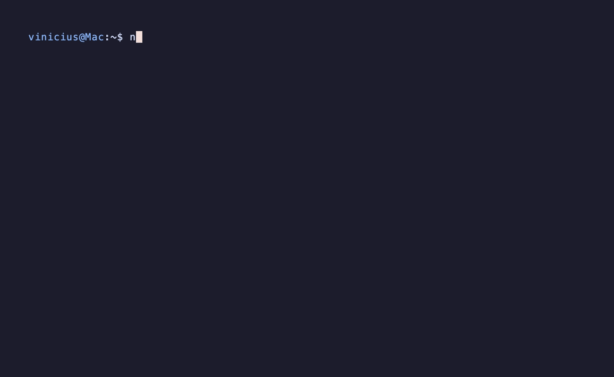

# Hi, there!

# 🚀 About Me

# 🧰 Dev Arsenal

  ## Programming and Markup Languages
  -  Python
  -  MATLAB
  -  Bash
  -  Java
  -  JavaScript
  -  HTML
  -  CSS

  ## Frameworks and Libraries
  -  TensorFlow
  -  PyTorch
  -  Keras
  -  LEAN Engine

  ## Software and Tools
  -  Visual Studio Code

